

  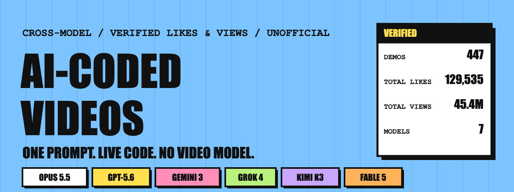

  
  

# Awesome AI-coded videos

A list of videos that were never filmed and never ran through a video-generation model. Someone gave an AI coding agent one text prompt, the agent wrote the whole thing as code (HTML Canvas, SVG, Three.js, WebGL/GLSL, CSS and GSAP), and the result is a screen recording of that code running live in a browser.

This list covers more than one model. Claude Opus 5.5 started the wave in the last week of September 2026, and the list tracks that wave in full, but it also verifies the same genre on GPT-5.6, Gemini 3, Claude Sonnet 5, Claude Fable 5, Grok and Kimi K3, and it collects the posts where someone ran the identical prompt across more than one model. Every like and view count below was pulled fresh from the post itself, not copied from another list.

Unofficial. Not affiliated with Anthropic, OpenAI, Google, xAI, Moonshot AI or any model maker named here.

## Contents

- [The numbers](#the-numbers)
- [Most-liked demos](#most-liked-demos)
- [Same prompt, different model](#same-prompt-different-model)
- [Claude Opus 5.5 wave](#claude-opus-55-wave)
- [Other models](#other-models)
- [Recorder tools](#recorder-tools)
- [Other lists](#other-lists)
- [Search demand](#search-demand)
- [How to try a prompt](#how-to-try-a-prompt)
- [How this list was made](#how-this-list-was-made)
- [Contributing](#contributing)
- [License](#license)

## The numbers

Snapshot 2026-09-29. Every count here comes from re-reading the post itself (`yt-dlp` for video posts, the X search API for the rest), not from another list's numbers.

| Number | Value |
| --- | --- |
| Demos tracked | 447 |
| Total likes | 129,535 |
| Total views | 45,361,507 |
| Models covered | 7 |
| Direct same-prompt, cross-model comparisons | 15 |
| Claude Opus 5.5 demos | 387 |
| Demos on other models | 60 |

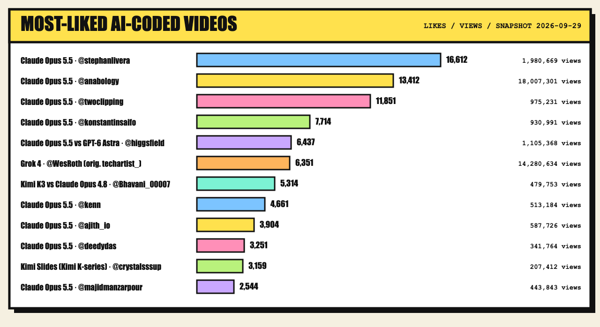

Demos by model:

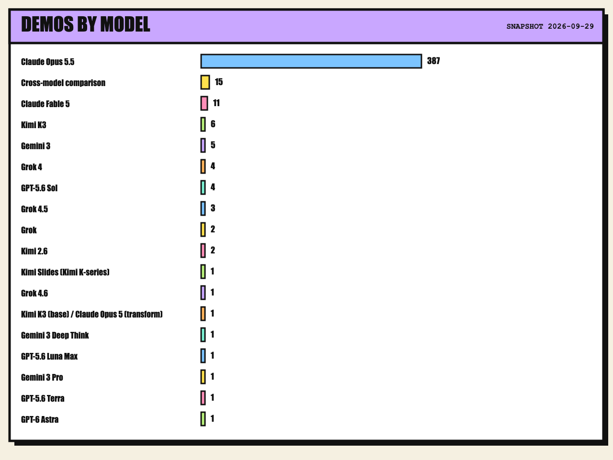

## Most-liked demos

The 30 most-liked demos across every model tracked here, ranked. Click a card to open the original post. Previews are stills pulled from the post itself; the video and the work belong to the creator. If a creator wants a card removed, open an issue.

<a href="https://x.com/stephanlivera/status/2103315922098470926">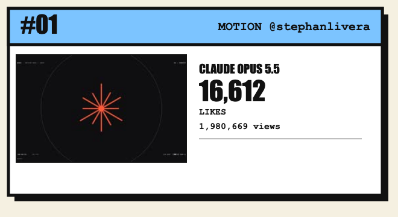</a>
<a href="https://x.com/anabology/status/2103534482930491441">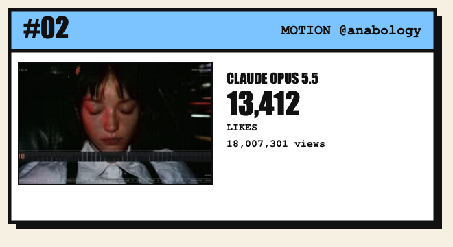</a>
<a href="https://x.com/twoclipping/status/2103273003555402193">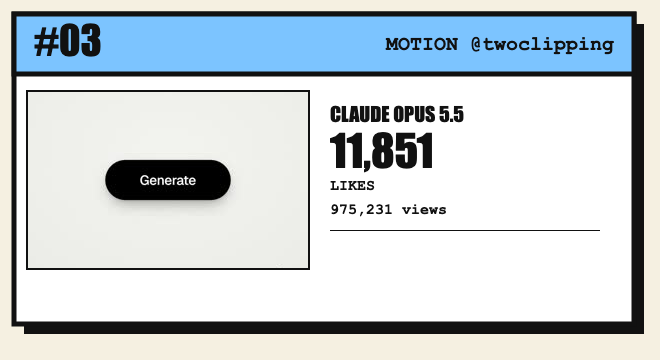</a>
<a href="https://x.com/konstantinsaifo/status/2104094723887501736">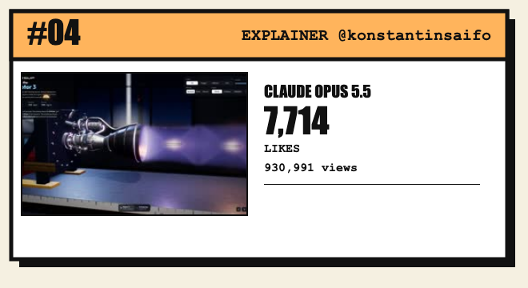</a>
<a href="https://x.com/higgsfield_ai/status/2102471046356177001">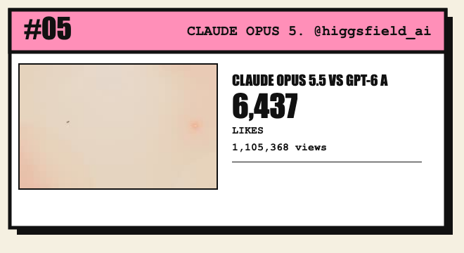</a>
<a href="https://x.com/WesRoth/status/1944721038182654146">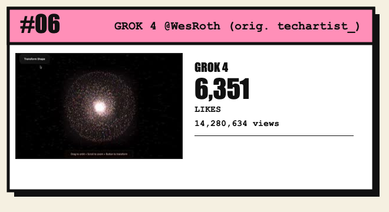</a>
<a href="https://x.com/Bhavani_00007/status/2077798166729208223">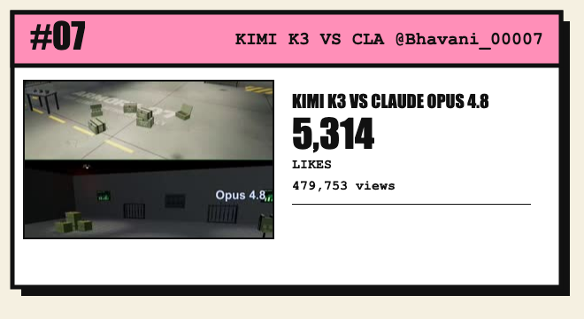</a>
<a href="https://x.com/kenn/status/2103337314021937232">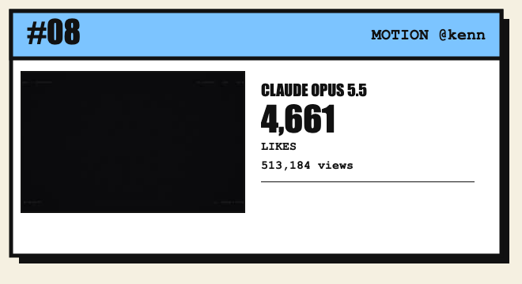</a>
<a href="https://x.com/ajith_io/status/2103449416325890146">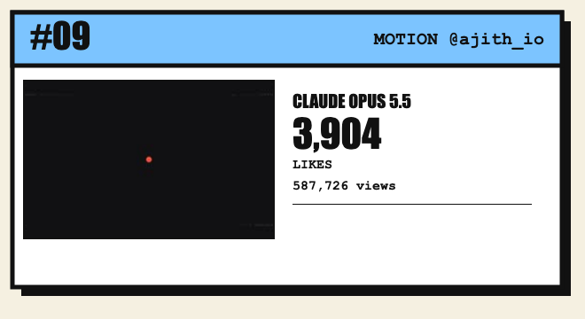</a>
<a href="https://x.com/deedydas/status/2102787937482252537">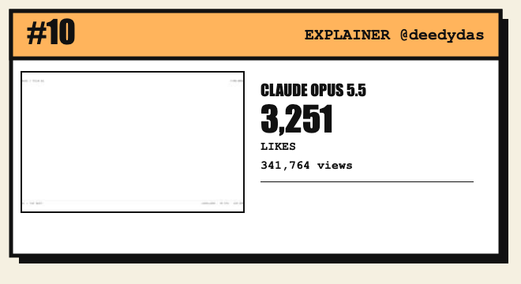</a>
<a href="https://x.com/crystalsssup/status/2014193604466786439">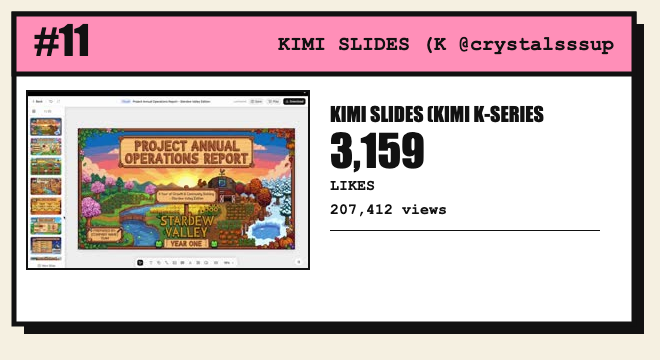</a>
<a href="https://x.com/majidmanzarpour/status/2102476258948927543">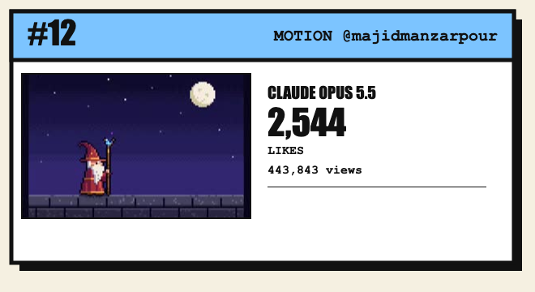</a>
<a href="https://x.com/claudeai/status/2104674987164782598">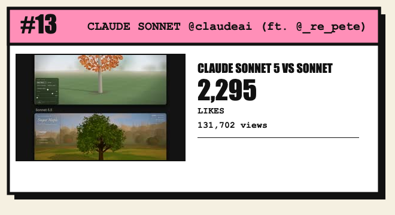</a>
<a href="https://x.com/twoclipping/status/2103835273813496100">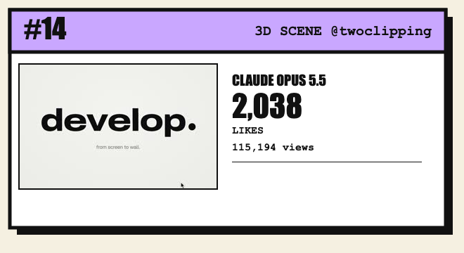</a>
<a href="https://x.com/cb_doge/status/2074920311896879359">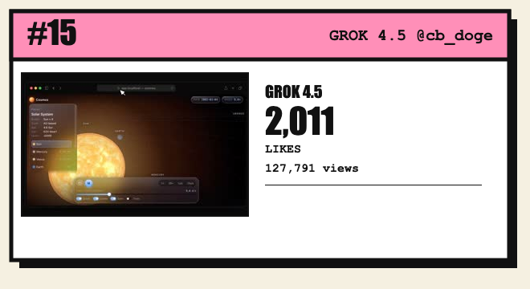</a>
<a href="https://x.com/moguzbulbul/status/2104206095313215591">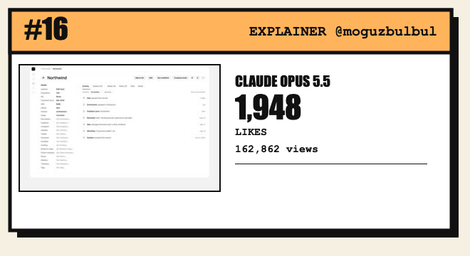</a>
<a href="https://x.com/adxtyahq/status/2080709349606150317">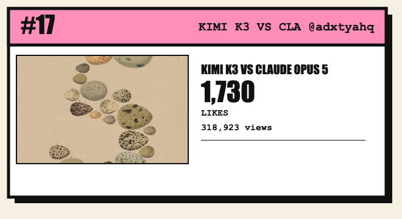</a>
<a href="https://x.com/himanshutwtxs/status/2103495232637882858">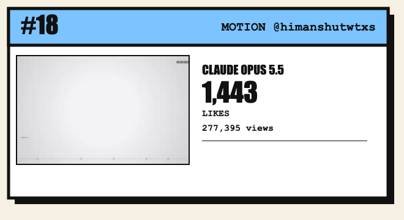</a>
<a href="https://x.com/gabrielbuzziv/status/2103590703289057430">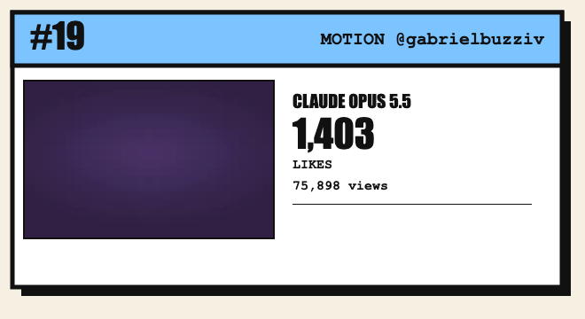</a>
<a href="https://x.com/measure_plan/status/1944127683241078937">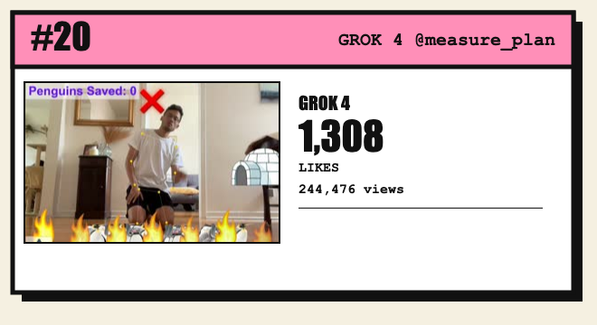</a>
<a href="https://x.com/op7418/status/2104085484347818226">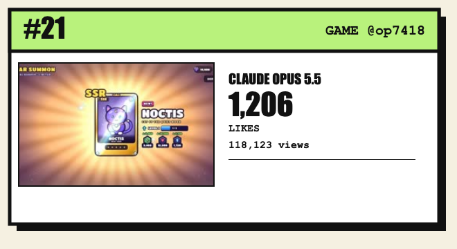</a>
<a href="https://x.com/zacxbt/status/2103789882309234711">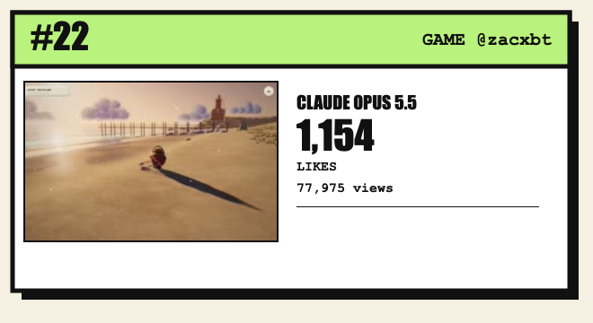</a>
<a href="https://x.com/alexalbert__/status/2102466523164274839">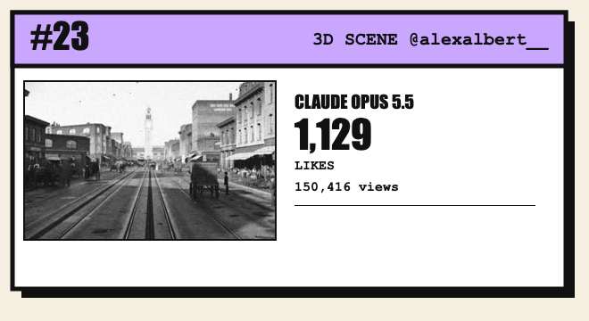</a>
<a href="https://x.com/MiaAI_lab/status/2103837519615774895">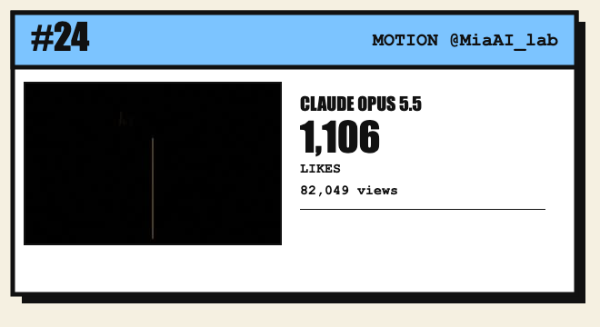</a>
<a href="https://x.com/Ror_Fly/status/2102853258582880547">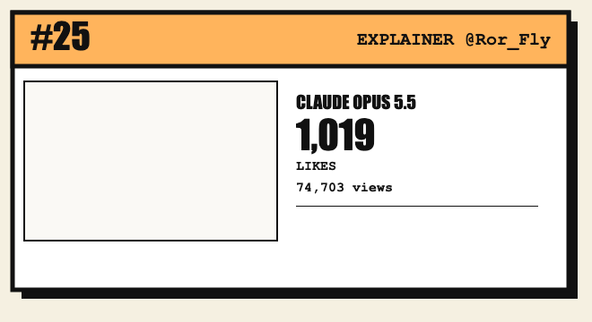</a>
<a href="https://x.com/ann_nnng/status/2103723183899852885">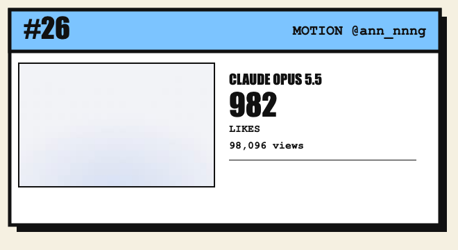</a>
<a href="https://x.com/thismacapital/status/2103773635714375808">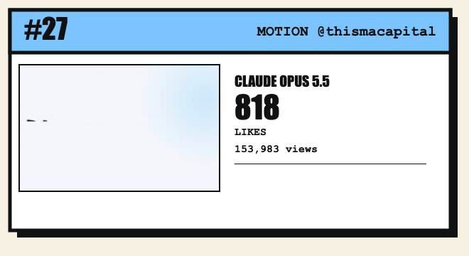</a>
<a href="https://x.com/gandamu_ml/status/2102919394775220530">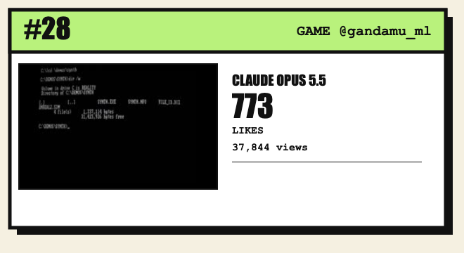</a>
<a href="https://x.com/koldo2k/status/2103129343253778767">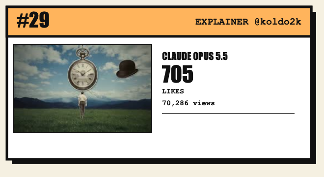</a>
<a href="https://x.com/Voxyz_ai/status/2103117246860345550">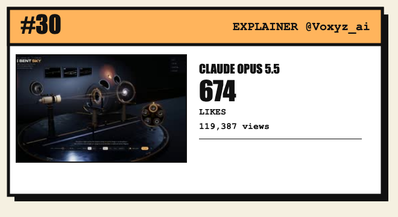</a>

## Same prompt, different model

The rarest and most useful entries: someone ran the exact same prompt on two or more models and posted both results. No other list on this topic tracks these as their own category.

| Likes | Models | By | What happened |
| --- | --- | --- | --- |
| 6,437 | Claude Opus 5.5 vs GPT-6 Astra | [@higgsfield_ai](https://x.com/higgsfield_ai/status/2102471046356177001) | Side-by-side samurai-themed 3D game demos comparing Claude Opus 5.5 vs GPT-6 Astra output on the same brief via Higgsfield. |
| 5,314 | Kimi K3 vs Claude Opus 4.8 | [@Bhavani_00007](https://x.com/Bhavani_00007/status/2077798166729208223) | Same prompt (armory bay with lighting/props/detail): Kimi K3 built a full detailed scene with working props; Opus 4.8 produced a near-empty room with floating tables. |
| 2,295 | Claude Sonnet 5 vs Sonnet 5.5 | [@claudeai](https://x.com/claudeai/status/2104674987164782598) | Official Anthropic thread of early Sonnet 5.5 experiments: a fall-foliage particle simulator built with Sonnet 5 vs the same build with Sonnet 5.5. |
| 2,011 | Grok 4.5 | [@cb_doge](https://x.com/cb_doge/status/2074920311896879359) | Solar system/universe simulation built from one prompt with Grok 4.5 and Three.js - same exact prompt text as a separate GPT-5.6 Sol post by @shiri_shh, making this a de facto cross-model comparison. |
| 1,730 | Kimi K3 vs Claude Opus 5 | [@adxtyahq](https://x.com/adxtyahq/status/2080709349606150317) | Independent re-run of the same Fall Guys same-prompt test: Kimi K3 nailed gameplay/physics in ~9 min/$4.4; Opus 5.0 had shinier UI but broken movement, ~17 min/$13+. |
| 551 | Claude Opus 5 vs Claude Fable 5 vs Kimi K3 vs GPT-5.6 | [@RoundtableSpace](https://x.com/RoundtableSpace/status/2080854300511862855) | 4-way same-prompt comparison video across Opus 5, Fable 5, Kimi K3 and GPT-5.6. |
| 86 | Claude Fable 5.1 vs Kimi K3 | [@RoundtableSpace](https://x.com/RoundtableSpace/status/2095553657978880489) | Same prompt, max reasoning on both: Fable 5.1 took 18 minutes for $12.60, Kimi K3 took 10 minutes for $6.95; both outputs looked impressive. |
| 77 | Kimi K3 vs Claude Opus 5 | [@QCXINT_](https://x.com/QCXINT_/status/2080957868002484242) | Same prompt to recreate Fall Guys from scratch: Kimi K3 (Kimi CLI) shipped smoother, more playable gameplay in ~9 min/$4.40; Claude Opus 5 (Claude Code) had better UI but broken movement in ~17 min/$13+. |
| 68 | GPT-5.6 Sol vs Claude Fable 5 | [@RoundtableSpace](https://x.com/RoundtableSpace/status/2077170024100331958) | Head-to-head: build a full Minecraft clone from scratch, one shot, no retries. Fable 5 finished in 90 minutes (vs 20 min on launch day), GPT-5.6 Sol in 70 minutes on first try. |
| 60 | Kimi K3 vs Claude Fable 5 | [@alextalksai](https://x.com/alextalksai/status/2079935489004450052) | Same prompt for an audio-synthesis interface: Kimi K3 produced a functional animated cyberpunk interface for $0.65; Fable 5 rendered an empty screen for ~$2. |
| 30 | Kimi K3 | [@s1rozha_](https://x.com/s1rozha_/status/2079148008315445287) | Rebuild of Minecraft, Fortnite and GTA clones (chunks/shaders/physics/cars) with Kimi K3 inside Kimi Code for VS Code at max effort, beating a prior Fable 5 attempt on the same games. |
| 27 | Claude Opus 5.5 vs Grok 4.7 vs Kimi K3 | [@Amank1412](https://x.com/Amank1412/status/2102453138968244378) | 3-way same-prompt test building an airplane game: environments and approach differed noticeably across all three models; author ranked Opus 5.5 > Kimi K3 > Grok 4.7. |
| 23 | GPT-6 Astra vs Kimi K3 | [@thebuggeddev](https://x.com/thebuggeddev/status/2100218303876927927) | Same dashboard-UI prompt given to Kimi K3 and GPT-6 Astra; Astra replicated the reference almost flawlessly in under 10 minutes, Kimi K3 took ~1 hour and missed some details. |
| 16 | GPT-5.6-Sol (+3 others) | [@Oluwaphilemon1](https://x.com/Oluwaphilemon1/status/2083017885744554109) | 4-way vibe-coding experiment: same prompt (scroll-driven explainer of PlayCanvas SOG Gaussian-Splat compression, WebGPU) run on GPT-5.6-Sol, Claude Fable 5, Kimi K3, and GPT-5.6-Sol inside Claude Code (Claudex), all at max reasoning. |
| 10 | Claude Sonnet 5.5 vs Kimi K3 | [@Amank1412](https://x.com/Amank1412/status/2104690275545485713) | Same prompt to build a racing game: Sonnet 5.5 delivered a more polished UI and smoother experience; Kimi K3 was surprisingly solid with similar FPS. |

## Claude Opus 5.5 wave

387 demos, verified 2026-09-29. Categories, by count: Motion graphics (222), Games and interactive (67), 3D scenes (51), Explainers (47).

Full list, all likes and views, is in [data/demos.csv](data/demos.csv). The top 40 by likes:

| Likes | Views | By | Category | Link |
| --- | --- | --- | --- | --- |
| 16,612 | 1,980,669 | @stephanlivera | Motion graphics | [post](https://x.com/stephanlivera/status/2103315922098470926) |
| 13,412 | 18,007,301 | @anabology | Motion graphics | [post](https://x.com/anabology/status/2103534482930491441) |
| 11,851 | 975,231 | @twoclipping | Motion graphics | [post](https://x.com/twoclipping/status/2103273003555402193) |
| 7,714 | 930,991 | @konstantinsaifo | Explainers | [post](https://x.com/konstantinsaifo/status/2104094723887501736) |
| 4,661 | 513,184 | @kenn | Motion graphics | [post](https://x.com/kenn/status/2103337314021937232) |
| 3,904 | 587,726 | @ajith_io | Motion graphics | [post](https://x.com/ajith_io/status/2103449416325890146) |
| 3,251 | 341,764 | @deedydas | Explainers | [post](https://x.com/deedydas/status/2102787937482252537) |
| 2,544 | 443,843 | @majidmanzarpour | Motion graphics | [post](https://x.com/majidmanzarpour/status/2102476258948927543) |
| 2,038 | 115,194 | @twoclipping | 3D scenes | [post](https://x.com/twoclipping/status/2103835273813496100) |
| 1,948 | 162,862 | @moguzbulbul | Explainers | [post](https://x.com/moguzbulbul/status/2104206095313215591) |
| 1,443 | 277,395 | @himanshutwtxs | Motion graphics | [post](https://x.com/himanshutwtxs/status/2103495232637882858) |
| 1,403 | 75,898 | @gabrielbuzziv | Motion graphics | [post](https://x.com/gabrielbuzziv/status/2103590703289057430) |
| 1,206 | 118,123 | @op7418 | Games and interactive | [post](https://x.com/op7418/status/2104085484347818226) |
| 1,154 | 77,975 | @zacxbt | Games and interactive | [post](https://x.com/zacxbt/status/2103789882309234711) |
| 1,129 | 150,416 | @alexalbert__ | 3D scenes | [post](https://x.com/alexalbert__/status/2102466523164274839) |
| 1,106 | 82,049 | @MiaAI_lab | Motion graphics | [post](https://x.com/MiaAI_lab/status/2103837519615774895) |
| 1,019 | 74,703 | @Ror_Fly | Explainers | [post](https://x.com/Ror_Fly/status/2102853258582880547) |
| 982 | 98,096 | @ann_nnng | Motion graphics | [post](https://x.com/ann_nnng/status/2103723183899852885) |
| 818 | 153,983 | @thismacapital | Motion graphics | [post](https://x.com/thismacapital/status/2103773635714375808) |
| 773 | 37,844 | @gandamu_ml | Games and interactive | [post](https://x.com/gandamu_ml/status/2102919394775220530) |
| 705 | 70,286 | @koldo2k | Explainers | [post](https://x.com/koldo2k/status/2103129343253778767) |
| 674 | 119,387 | @Voxyz_ai | Explainers | [post](https://x.com/Voxyz_ai/status/2103117246860345550) |
| 651 | 100,895 | @leonabboud | Motion graphics | [post](https://x.com/leonabboud/status/2103576084499358051) |
| 634 | 102,790 | @ajith_io | Motion graphics | [post](https://x.com/ajith_io/status/2103469807375208546) |
| 619 | 29,316 | @LexnLin | Games and interactive | [post](https://x.com/LexnLin/status/2103194052850241739) |
| 605 | 50,873 | @twoclipping | 3D scenes | [post](https://x.com/twoclipping/status/2102554209166000267) |
| 553 | 68,526 | @emollick | Explainers | [post](https://x.com/emollick/status/2103688362960019567) |
| 422 | 35,337 | @songkeys | Motion graphics | [post](https://x.com/songkeys/status/2102743212922384673) |
| 410 | 90,623 | @moritzkremb | Motion graphics | [post](https://x.com/moritzkremb/status/2103066071838466494) |
| 371 | 40,456 | @alex_prompter | Explainers | [post](https://x.com/alex_prompter/status/2103499977632997524) |
| 361 | 20,682 | @VectorCrossProd | 3D scenes | [post](https://x.com/VectorCrossProd/status/2104093497561436573) |
| 342 | 73,245 | @Michaelzsguo | 3D scenes | [post](https://x.com/Michaelzsguo/status/2102592355165782312) |
| 339 | 134,546 | @op7418 | Games and interactive | [post](https://x.com/op7418/status/2103724883301814408) |
| 339 | 29,153 | @rehan_shei | Games and interactive | [post](https://x.com/rehan_shei/status/2103755997533839416) |
| 306 | 35,654 | @konstantinsaifo | Explainers | [post](https://x.com/konstantinsaifo/status/2104216976801587629) |
| 295 | 33,761 | @kentcdodds | Motion graphics | [post](https://x.com/kentcdodds/status/2103638102333858193) |
| 289 | 61,256 | @sab8a | Motion graphics | [post](https://x.com/sab8a/status/2103144778481475686) |
| 285 | 51,100 | @pbteja1998 | Motion graphics | [post](https://x.com/pbteja1998/status/2103176101497651644) |
| 283 | 25,300 | @davidmarcus | Motion graphics | [post](https://x.com/davidmarcus/status/2103275618045686217) |
| 268 | 31,320 | @techhalla | Motion graphics | [post](https://x.com/techhalla/status/2103411244468498547) |
## Other models

45 verified demos on models other than Opus 5.5, not counting the cross-model comparisons above (those are listed once, in their own section). Full data in [data/demos.csv](data/demos.csv).

### Grok 4

- [6,351 likes](https://x.com/WesRoth/status/1944721038182654146) by @WesRoth (orig. techartist_). Interactive 3D particle system with custom GLSL shaders morphing between dynamic attractor patterns, coded with Grok 4, Three.js and GLSL.
- [1,308 likes](https://x.com/measure_plan/status/1944127683241078937) by @measure_plan. Real-time webcam exercise-tracking game 'planking for penguins', coded with Grok 4, Three.js, Tone.js and MediaPipe vision.
- [527 likes](https://x.com/measure_plan/status/1957851192060424675) by @measure_plan. Hand-gesture-controlled 3D voxel design tool (parametric surface, amplitude/frequency/color controls) built with Grok 4, Three.js and MediaPipe vision.
- [97 likes](https://x.com/measure_plan/status/1958187837020327946) by @measure_plan. Hand-gesture-controlled real-time audio+3D visual interface, coded with Grok 4, Three.js, Tone.js, MediaPipe vision.

### Kimi Slides (Kimi K-series)

- [3,159 likes](https://x.com/crystalsssup/status/2014193604466786439) by @crystalsssup. 25-slide Stardew-Valley-style pixel-art PPT generated in one shot with Kimi Slides from a single detailed prompt.

### Claude Fable 5

- [394 likes](https://x.com/kevin_t_ngo/status/2091356904970981833) by @kevin_t_ngo. 'Creator of Worlds' - describe a dream world to an AI dragon that generates and takes you to the planet, built with Fable 5 and Three.js.
- [169 likes](https://x.com/thedzianis/status/2087638178635403271) by @thedzianis. Interactive grass scene you can brush through, built with Fable 5 and Three.js.
- [151 likes](https://x.com/hive_echo/status/2064840850312716463) by @hive_echo. Kinematically exact V16 engine you can slice open and watch run, built with Fable 5 and Three.js.
- [115 likes](https://x.com/kevin_t_ngo/status/2093020864992494032) by @kevin_t_ngo. Explainer video of the Hugging Face AI-sandbox-escape incident, built with Fable 5 and Three.js.
- [58 likes](https://x.com/AIandDesign/status/2079255154294165628) by @AIandDesign. Three procedurally generated creepy liminal-space 'walking simulator' environments built with Fable 5 powered by Godot.
- [33 likes](https://x.com/hive_echo/status/2064821171733111153) by @hive_echo. 'Mozaic' generative instrument where grids/fields/marks recombine into evolving geometric compositions, built with Fable 5 and Three.js.
- [31 likes](https://x.com/hive_echo/status/2064776499774074979) by @hive_echo. Generative digital-organism visualization spun from math, drifting in translucent light, built with Fable 5 and Three.js.
- [31 likes](https://x.com/hive_echo/status/2064530971119259822) by @hive_echo. 'Lumen' - luminous bubble visual playground built with Fable 5 and Three.js.
- [27 likes](https://x.com/hive_echo/status/2065299741827899396) by @hive_echo. Colorful voxel-construction 'viaduct over candy vale' scene built with Fable 5 and Three.js.
- [15 likes](https://x.com/hive_echo/status/2064511850260435307) by @hive_echo. 'Atrament' ink-simulation visual playground built with Fable 5 and Three.js.
- [3 likes](https://x.com/cyph3rf0x/status/2073259478120550436) by @cyph3rf0x. Real-time interactive fully-3D polygonal Quake-like FPS running on an emulated 1MHz 6502 Apple II, built with Fable 5.

### Grok 4.5

- [511 likes](https://x.com/runzhuotao/status/2075366324436685151) by @runzhuotao. Voxel-style map benchmark test built with Grok 4.5, Blender/Three.js pipeline.
- [373 likes](https://x.com/aniketjart/status/2075277986023211180) by @aniketjart. Game-dev demo built with Grok 4.5 and Crayon on Three.js.

### Grok 4.6

- [496 likes](https://x.com/DannyLimanseta/status/2089023171672609084) by @DannyLimanseta. Horde-shooter prototype with thousands of onscreen enemies built with Grok 4.6 on Three.js/WebGPU (UI, VFX, SFX all AI-generated; only character models from Meshy).

### GPT-5.6 Sol

- [152 likes](https://x.com/hightbunker/status/2076512357153382600) by @hightbunker. Short demo of something built in 3 hours with GPT-5.6 Sol (tech not specified in tweet).
- [84 likes](https://x.com/diegocabezas01/status/2076402353104724198) by @diegocabezas01. Gladiator Arena simulation/game built with GPT-5.6 Sol, pitting GPT-5.4-nano vs Claude Haiku 4.5 API agents against each other.
- [34 likes](https://x.com/shiri_shh/status/2075310652193976829) by @shiri_shh. Single-prompt real-time solar system/universe simulation with adjustable time speed, orbits and a styled HUD.
- [4 likes](https://x.com/MrPrewsh/status/2075361068990308844) by @MrPrewsh. One-paragraph single prompt motion/demo built with GPT-5.6 Sol.

### Kimi K3 (base) / Claude Opus 5 (transform)

- [261 likes](https://x.com/0xRishi/status/2081230708593590378) by @0xRishi. A Kimi K3-built Three.js game (all assets, weapons, effects generated as code, no pre-made assets) was then transformed in a single prompt by Claude Opus 5.

### Kimi K3

- [70 likes](https://x.com/DilumSanjaya/status/2088671105292890308) by @DilumSanjaya. Content-heavy Game of Thrones lore explorer site (characters, houses, dragons, interactive map, timeline) built with Kimi K3.
- [34 likes](https://x.com/VORTEX_Promos/status/2077879705378730074) by @VORTEX_Promos. Whole playable battle arena built in one shot from a single reference image with Kimi K3, which took #1 on the Frontend Code Arena leaderboard, surpassing Claude Fable 5.
- [34 likes](https://x.com/mikenevermiss/status/2094797842132906298) by @mikenevermiss. App that takes a 2D tank schematic and turns it into an explorable 3D model, fully code-generated with Kimi K3.
- [24 likes](https://x.com/mhdfaran/status/2077851660219740489) by @mhdfaran. Generic demo clip captioned 'made with kimi k3' alongside the Kimi K3 launch announcement.
- [3 likes](https://x.com/nuvolore/status/2083410736110543262) by @nuvolore. Full game built with Kimi K3 and RUN_Creators in about an hour.

### Claude Opus 5.5 + GPT-6 Sol

- [106 likes](https://x.com/higgsfield_ai/status/2102781807179735211) by @higgsfield_ai. Vibe-coded seamless looping 'water cycle' animation, built and rendered entirely in code in real time in the browser, packaged as a single offline HTML file with timeline controls.

### Grok

- [47 likes](https://x.com/Graalitoo/status/2090411195132158378) by @Graalitoo. Looping Three.js scene vibe-coded with Grok.
- [13 likes](https://x.com/RealFedeURU/status/2089321227953307885) by @RealFedeURU. Visual scene created with Three.js and Grok.

### Gemini 3

- [40 likes](https://x.com/prasenx/status/2001597866993946806) by @prasenx. Demo clip captioned 'made with Gemini 3 btw'.
- [3 likes](https://x.com/GeokenAI/status/1999510368993853712) by @GeokenAI. Vibe-coded 'Voices from History' app: press a button on any place/time in history to hear a historical reenactment, built with Gemini 3 on AI Studio.
- [3 likes](https://x.com/Gdgtify/status/1991878768734998959) by @Gdgtify. Wave-particle music visualizer built in a couple of minutes with Gemini 3.
- [3 likes](https://x.com/LorenzoGiampie7/status/2001353862763233765) by @LorenzoGiampie7. First-attempt SwiftUI prototype app to digitize vinyl records via barcode scan, built with Gemini 3.
- [2 likes](https://x.com/xai_42/status/1991416637531328513) by @xai_42. Short football-themed visual/animation demo made with Gemini 3.

### Gemini 3 Deep Think

- [50 likes](https://x.com/gjb_ai/status/2022113660458741798) by @gjb_ai. US National Parks road-trip planner web app (collect all 63 park emojis) built with Gemini 3 Deep Think.

### GPT-5.6 Luna Max

- [43 likes](https://x.com/givros/status/2086424701883015434) by @givros. 24-hour vibe-coded Unity game 'Coffee Shop Organizer' built with GPT-5.6 Luna Max + Codex handling the C# coding, using free Unity Asset Store assets.

### Gemini 3 Pro

- [40 likes](https://x.com/LexnLin/status/2046655451203354756) by @LexnLin. A built website the author says was probably made with Gemini 3 Pro.

### Kimi K3 + Claude Opus 5

- [17 likes](https://x.com/PugTheDev/status/2081459725875790245) by @PugTheDev. Liquid Glass macOS terminal with Claude-Desktop-style docking, built with Kimi K3 and Opus 5.

### GPT-5.6 Terra

- [16 likes](https://x.com/TokenGremlin/status/2075352227191869826) by @TokenGremlin. Demo built with GPT-5.6 Terra with thinking disabled, showcasing model capability without extended reasoning.

### GPT-6 Astra

- [6 likes](https://x.com/R_ChajX/status/2103098256066523405) by @R_ChajX. Interactive 3D human-anatomy atlas with 2,234 separate explorable 3D elements (bones, muscles, organs) built with GPT-6 Astra.

### Kimi 2.6

- [3 likes](https://x.com/AntSeed/status/2047054750185566518) by @AntSeed. Short video made with Kimi 2.6 and Remotion from a two-line prompt.
- [2 likes](https://x.com/0xMstar/status/2065838365795320076) by @0xMstar. Demo clip captioned 'Made with Kimi 2.6'.
## Recorder tools

The actual step that turns a live canvas or WebGL page into a video file. Both are generic, both are open source, and both were found on GitHub, not linked from any single commercial site.

- [dmnsgn/canvas-record](https://github.com/dmnsgn/canvas-record). General-purpose browser library (not AI-specific) that records a 2D/WebGL/WebGPU canvas region to MP4/WebM/MKV/MOV/GIF/image-sequence via WebCodecs, the kind of tool used to turn an AI-coded canvas animation into an actual video file for posting. 431 stars, JavaScript, MIT.
- [amandaghassaei/canvas-capture](https://github.com/amandaghassaei/canvas-capture). Browser library wrapping CCapture.js and ffmpeg.wasm to export a canvas as PNG/JPEG, MP4/WebM video, or GIF, the same recording step used to publish AI-generated Canvas/WebGL animations as social video. 239 stars, TypeScript, MIT.
## Other lists

A wave of near-identical lists on this exact topic appeared on GitHub in the four days before this one was built, several of them linking every entry to the same commercial site with UTM tracking parameters. Listed here for transparency, not endorsement. None of them cross-verify engagement live, and none cover more than one model.

- [yihui-dev/awesome-opus5-5-videos](https://github.com/yihui-dev/awesome-opus5-5-videos). Largest of the awesome lists in this space: 389 viral videos made by prompting Claude Opus 5.5 to write the animation as HTML/Canvas/SVG/Three.js code, each with the creator's original prompt or post, plus 'watch side by side with a live remake' links into skillry.dev (with UTM tracking on every link). 692 stars, MIT.
- [athemeroy/awesome-opus-5-5-videos](https://github.com/athemeroy/awesome-opus-5-5-videos). Data-heavy, source-linked catalog of Opus 5.5 videos (1,511 candidate X posts, 168 reviewed cases) with a vision-model-classified domain x visual-style atlas, color-mode study, and a 'production path' guide distinguishing rendering-code videos from external-model or edited-footage videos. 309 stars, CC-BY-4.0.
- [opusvideo/awesome-claude-video](https://github.com/opusvideo/awesome-claude-video). Bilingual (EN/CN) curated gallery of Claude Opus 5.5 videos and animations with original posts, prompts, and workflows, plus a separate 'full implementation guide' doc for every case that has a disclosed prompt. 150 stars, no license.
- [joeseesun/opus-video-prompts](https://github.com/joeseesun/opus-video-prompts). Copy-ready prompt library (54 cases, 18 full prompts) for generating Claude Opus 5.5 code-rendered videos, bilingual CN/EN how-to. 81 stars, no license.
- [chuspeeism/awesome-opus-5-5-videos](https://github.com/chuspeeism/awesome-opus-5-5-videos). Chinese-language collection of 300 Claude Opus 5.5 video cases grouped by use case (motion graphics, brand/product, story/music, education, 3D), with videos embedded and playable directly in the README and a companion demo site. 79 stars, Other.
- [zhuyansen/awesome-opus-5.5-video](https://github.com/zhuyansen/awesome-opus-5.5-video). List of 962 Opus 5.5-attributed videos/motion graphics/3D scenes/games from X (252 with a prompt, 94 full prompts), gated by a 5,000-view inclusion threshold, linking out to a browsable prompt site (jasonzhu.ai). 20 stars, no license.
- [LeaddeOpenLab/awesome-opus-5-5-video-prompts](https://github.com/LeaddeOpenLab/awesome-opus-5-5-video-prompts). Smaller, newer list framed as 'agent instructions' for Opus 5.5 video/animation/interactive-scene generation, naming explicit tool roles and rendering sources rather than just linking tweets. 4 stars, no license.
- [real-leo/awesome-opus-videos-aggregate](https://github.com/real-leo/awesome-opus-videos-aggregate). Meta-list that deduplicates and cross-indexes four of the community Opus 5.5 video lists above (athemeroy, joeseesun, yihui-dev, chuspeeism) into one bilingual hub of 846 unique items with category and source breakdowns, without republishing prompts or footage itself. 0 stars, Other.
## Search demand

Google search volume in the US, from a keyword-data provider called through treg on 2026-09-29.

| Keyword | Monthly searches | CPC (USD) |
| --- | --- | --- |
| vibe coding | 110,000 | $3.20 |
| ai generated video | 18,100 | $0.95 |
| ai animation generator | 3,600 | $1.27 |
| ai motion graphics | 480 | $1.76 |
| text to animation ai | 260 | $0.95 |
| prompt to video | 260 | $72.35 |

"Vibe coding" already has real search volume, and "prompt to video" carries the highest cost per click in the set by a wide margin, which means advertisers value that exact phrase. Model-specific terms ("claude opus video", "gpt 5.6 video") had no data yet as of this snapshot, most likely because the wave is under two weeks old.

## How to try a prompt

1. Open a post linked above and read what the creator says they used.
2. Give the same prompt, or your own, to an agent running that model.
3. Ask it to render the result as a single HTML file, then record the page (see [Recorder tools](#recorder-tools)).

Most creators describe their prompt in the post text. A few only describe the result. Where a post is a direct comparison, the exact same prompt was used on every model named.

## How this list was made

Two sources, both re-verified rather than copied:

1. **Claude Opus 5.5 wave.** A public, MIT-licensed dataset of 389 candidate posts ([yihui-dev/awesome-opus5-5-videos](https://github.com/yihui-dev/awesome-opus5-5-videos)) gave the lead list of post URLs. Every single one was re-fetched directly from X with `yt-dlp` on 2026-09-29 for its real like count, view count, repost count and reply count. 387 of 389 resolved; the rest returned a deleted or protected post at fetch time. No description, image or number was copied from that repository; only the post URLs were used as a starting point.
2. **Other models.** A fresh search across X for the same genre on GPT-5.6, Gemini 3, Claude Sonnet 5, Claude Fable 5, Grok and Kimi K3, plus direct same-prompt comparisons, all pulled live from the X search API on 2026-09-29 with real engagement numbers attached at the time of the search.

Likes and views are a snapshot and will be out of date the day after this is read. The [data](data) folder has the same numbers as CSV.

## Contributing

Open a pull request that adds one entry.

1. Link to the original post. It must show the code running live, not a video-generation model's output.
2. Name the model, if the creator says which one.
3. Give numbers as reported by the post at the time you check it, and say when you checked.
4. Use this format: `- [N likes](link) by @author. One sentence on what it shows.`
5. Open every link before you submit it.

A same-prompt, cross-model comparison is worth more than another single-model demo.

## License

[CC0 1.0](LICENSE)
